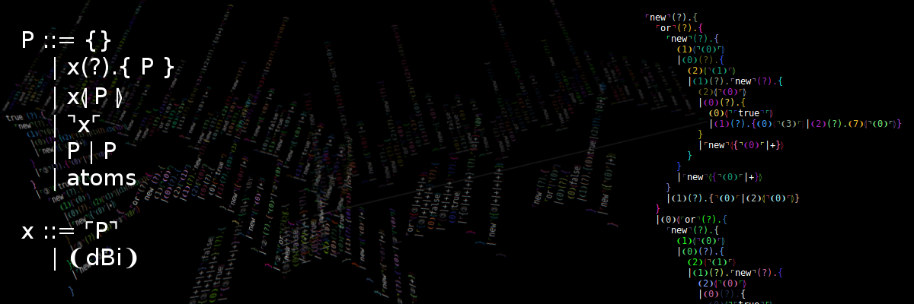
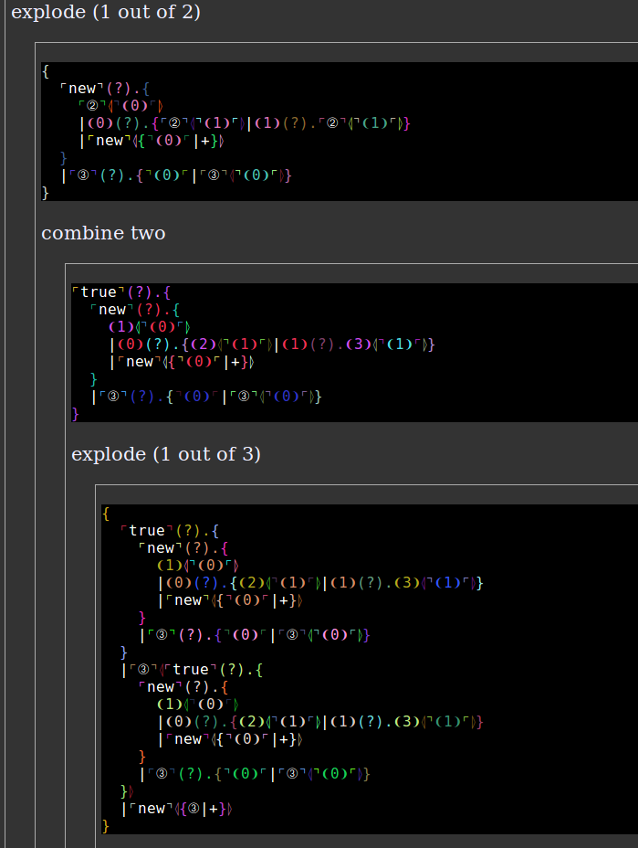

# rhocalc



Implementation of an EDSL for experimenting with [rho-calculus [Meredith, Radestock; 2005]](https://www.sciencedirect.com/science/article/pii/S1571066105051893).

A little demo that shows that

  * a distributed service that imitates a `new` operator
  * sending and receiving of multiple messages at once
  * replication
  * contracts (self-respawning services / receive-terms)
  * function definitions and invocations
  * nested expressions
  * Church-like encoding of Booleans

can be implemented in raw rho-calculus augmented 
with string-atoms (which are merely distinguishable, but otherwise unstructured).

Programs are defined and compiled as follows:

```scala
  val p = new Prog {
    def initialState[F[+_]](implicit j: Justification[F]) = {
      import Edsl._
      import j._
      val functionCall = 
        And(Or(False, True), Or(And(False, True), True)).returnTo(&("out"))
      compile(
        root(news, "`new` service"),
        root(BooleanFns, "boolean functions 'package'"),
        root(functionCall, "initial function call")
      )
    }
  }
```

The important parts are:

  * importing all the stuff from `Edsl._`
  * defining some initial terms (here: `functionCall` is the only term that is evaluated)
  * loading "dependencies", in this case, the `new`-service and `BooleanFns` with all
    the booleans that are already implemented in the Edsl.
  * attaching tags to the terms (`String`s passed as second argument to `root`),
    to make the tracing somewhat comprehensible.
  * compiling everything together into one big rho-calculus term using the `compile` method.

Then the program can be executed as follows:

    val s1 = p.run(TracingInterpreter("/tmp/andorftorandftt.html"))

This will generate a hilariously gigantic and colorful tracing output in `/tmp/andorftorandftt.html`
that looks somewhat like this:



The final result of this particular computation is the following rho-calculus process:

    ⌜out⌝⦉true⦊

The output uses the notation that is close to the notation in the paper. 
The tracing output is interactive: it highlights matching braces and "local variables" (which are represented
by de-Bruijn indices).

See the source code (`rhocalc.scala`) for more examples.
If anyone ever considers to write more "programs" with it, the easiest way would be
to copy one of the examples, and change the "source code" a little.
